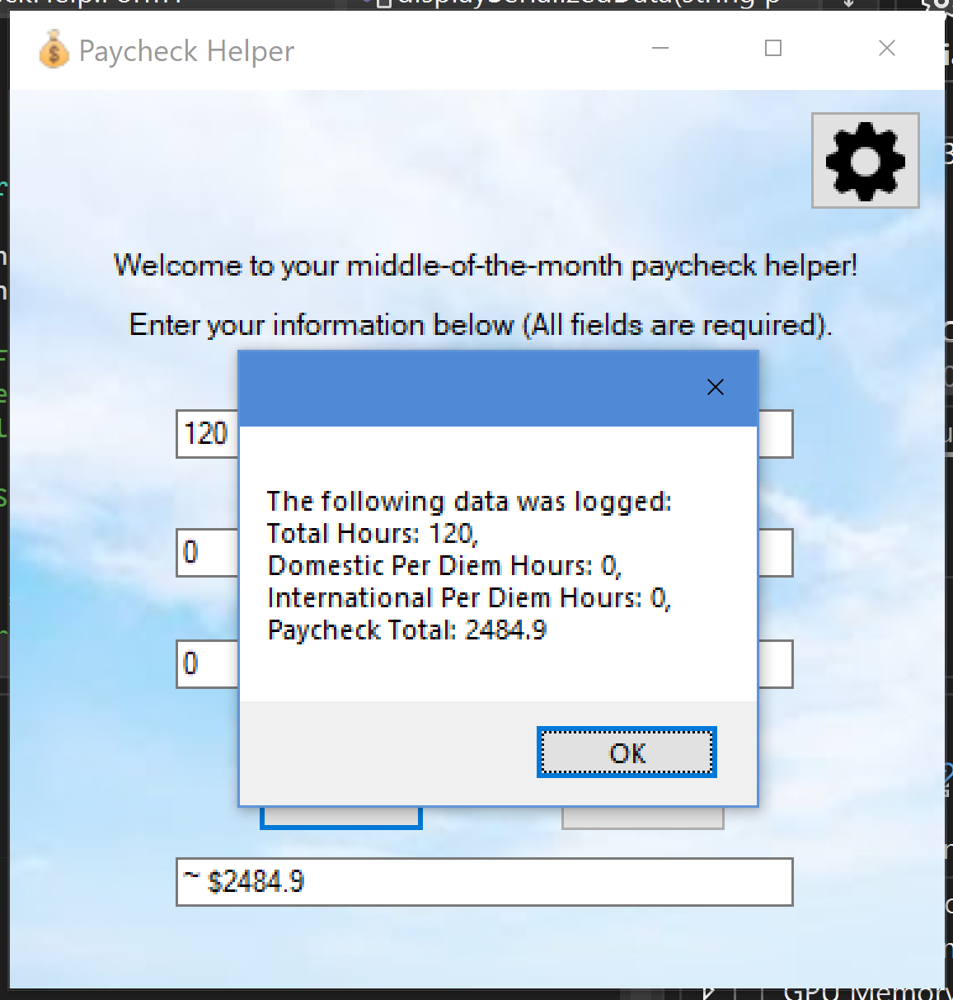

# PaycheckHelper

## Table of Contents
1. [Functionality Screenshots](#functionality-screenshots)
2. [Application Description](#application-description)
3. [Technologies Used](#technologies-used)
4. [Developer Information](#developer-information) 

## Functionality Screenshots

Calculation                 |  Exception Handling             
:-------------------------:|:-------------------------:
  |   

Stored User Settings       |  ...             
:-------------------------:|:-------------------------:
  |  

XML Serialization/Deserialization  |             
:-------------------------:|
 

[Back to Table of Contents](#table-of-contents)

## Application Description

This is a small, but growing personal project software application. Paycheck Helper was designed to 
help Flight Attendants calculate their notoriously complicated paychecks each month. The application 
provides fields for user input based on pay period data and runs calculations to determine an estimated 
paycheck amount. Each paycheck amount is Serialized and logged in a .txt file on the user's machine 
to assist with tracking accuracy, budgeting needs, etc. The paycheck amount is then Deserialized and displayed 
to the user. The application also allows for stored user settings which can be changed by the user based on pay 
increases, tax changes, etc. All field data is checked and exceptions are handled. Potential future features for 
this application include an interface for reading previously logged paychecks, GUI improvements, and 
database connectivity. 

[Back to Table of Contents](#table-of-contents)

## Technologies Used
- C#/.NET
- Visual Studio Community IDE
- XML

[Back to Table of Contents](#table-of-contents)

## Developer Information
Programmed by Andrew B. Schaefer [(Ab0213ab)](https://github.com/Ab0213ab).

LinkedIn: https://www.linkedin.com/in/andrewbschaefer/

Email: Abs233abs@gmail.com 

[Back to Table of Contents](#table-of-contents)

